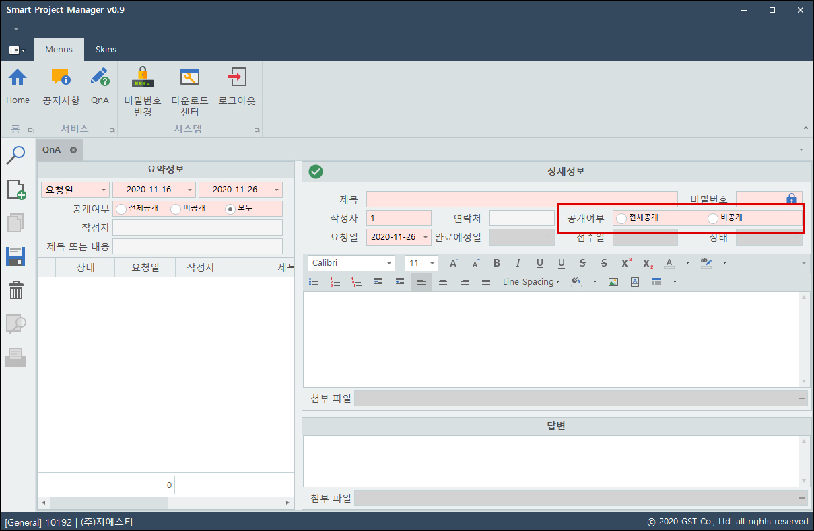

# Update Contents

## ver. 20210622-01

### ※ 고객사 문의에 대한 "처리완료일" 관리 항목 추가

* \[접수 및 답변\]에서 "처리완료일" 항목에 직접 입력 후 저장 시 반영
* \[접수 및 답변\]에서 "상태"를 '완료'로 변경 시 "처리완료일" 자동 세팅
* \[답변 작성\] 팝업창에서 "처리 완료"에 체크 후 저장 시 자동 업데이트

![\[&#xC811;&#xC218; &#xBC0F; &#xB2F5;&#xBCC0;\]](.gitbook/assets/image%20%283%29.png)

### ※ \[Q&A\] 변경 내용

* "확인" 항목의 명칭을 "답변 확인"으로 변경
* "처리완료일" 항목 추가

![\[Q&amp;A\]](.gitbook/assets/image%20%287%29.png)

### ※ \[업무지시\] 메뉴 리뉴얼

* "미참조 업무지시" 에서 "업무지시\(전체\)"로 변경
* "업무지시\(전체\)" 탭에서 **모든 업무지시 내용 조회**가 가능하며, **미참조 업무지시의 자료 참조 및 기존 업무지시의 참조 변경 가능**

### ※ \[서비스 정보\] 변경 내용

* "로그인 기록" 탭에 "사업자등록번호" 항목 추가

### ※ 지에스티용 홈 화면

* 디자인 변경
* 홈 화면에서 차트 스크롤 사용 중 오류 수정

### ※ 문의 알림 기능 개선

## ver. 20210618-01 \(release 0.9.18\)

### ※ \[서비스 정보\] 신규 메뉴

* '서비스 현황' 탭에서 업체별 접속 도메인과 신플/구플 여부를 확인

* '로그인 기록' 탭에서 서비스에 접속한 기록을 확인

### ※ 문의 알림 기능 버그 수정

* 일정 시간 경과 후 불특정하게 기능이 동작하지 않던 현상 수정

## ver. 20210617-01 \(release 0.9.16\)

### ※ 시스템 트레이 적용

* \[트레이 아이콘 우클릭 - 종료\] 메뉴를 통해야 프로그램이 완전히 종료
* 응용 프로그램이 하나의 프로세스만 할당 가능

### ※ 고객사 문의 내용 알림

* 고객사에서 Q&A를 작성하면 접수 담당 업체를 확인하여 "업체명, 작성자, 제목" 정보를 알림

* 우측 상단 메뉴를 통해 알림 On/Off 가능

* 고객사에서 접속시에는 해당 메뉴 비활성화

## ver. 20210315-01

### ※ \[회의록 열람\]

* 지에스티 계정으로 접속시, **'고객 열람' 항목이 적용되지 않은 상태를 기본값으로 변경**

### ※ \[접수 및 답변\]

* 직접 접수 자료\(접수 구분이 '문의'가 아닌 자료\)에 대하여 **삭제 버튼 클릭시 접수 여부를 판단하여 "접수 취소"가 가능**하도록 업데이트 \(기존의 접수일지번호 컬럼의 삭제 버튼 기능\)
* 접수 구분이 **'문의'가 아닌 자료에도 답변을 등록**할 수 있도록 업데이트

## ver. 20210105-01

### ※ \[회의록 열람\] 신규 메뉴 추가

* 지에스티에서 \[회의록 관리\] 메뉴를 통해 등록된 **회의 내용을 해당 업체와 공유**
* **'고객 열람'** 항목에 체크가 되어있는 데이터만 업체에서 확인 가능

![\[&#xC9C0;&#xC5D0;&#xC2A4;&#xD2F0;&#xC5D0;&#xC11C; &#xC785;&#xB825;&#xD55C; &#xD68C;&#xC758; &#xB0B4;&#xC6A9;\]](.gitbook/assets/image%20%2839%29.png)

![\[&#xACE0;&#xAC1D;ID&#xB85C; &#xC811;&#xC18D;&#xD55C; &amp;lt;&#xD68C;&#xC758;&#xB85D; &#xC5F4;&#xB78C;&amp;gt; &#xBA54;&#xB274;&#xC758; &#xD654;&#xBA74;\]](.gitbook/assets/image%20%2849%29.png)

![\[&#xC9C0;&#xC5D0;&#xC2A4;&#xD2F0; ID&#xB85C; &#xC811;&#xC18D;&#xD55C; &amp;lt;&#xD68C;&#xC758;&#xB85D; &#xC5F4;&#xB78C;&amp;gt; &#xBA54;&#xB274;&#xC758; &#xD654;&#xBA74;\]](.gitbook/assets/image%20%2812%29.png)

## ver. 20201125-02

### ※ \[Q&A\] '비밀번호 잠금' 기능 변경

<table>
  <thead>
    <tr>
      <th style="text-align:left"></th>
      <th style="text-align:left">&#xB0B4;&#xC6A9;</th>
    </tr>
  </thead>
  <tbody>
    <tr>
      <td style="text-align:left">&#xBCC0;&#xACBD;&#xC804;</td>
      <td style="text-align:left">&#xBE44;&#xBC00;&#xBC88;&#xD638; &#xC7A0;&#xAE08; &#xD65C;&#xC131;&#xD654;&#xC2DC;
        &#xBB34;&#xC870;&#xAC74; &#xBE44;&#xBC00;&#xBC88;&#xD638;&#xB97C; &#xC785;&#xB825;&#xD574;&#xC57C;&#xB9CC;
        &#xC5F4;&#xB78C;&#xC774; &#xAC00;&#xB2A5;</td>
    </tr>
    <tr>
      <td style="text-align:left">&#xBCC0;&#xACBD;&#xD6C4;</td>
      <td style="text-align:left">
        
<b>1)</b> &#xACF5;&#xAC1C; &#xC5EC;&#xBD80;&#xAC00; &apos;&#xBE44;&#xACF5;&#xAC1C;&apos;&#xB85C;
          &#xC124;&#xC815;&#xB41C; &#xB370;&#xC774;&#xD130;&#xC77C; &#xB54C;&#xB9CC;
          &#xBE44;&#xBC00;&#xBC88;&#xD638; &#xC785;&#xB825;&#xD6C4; &#xC5F4;&#xB78C;.

        
<b>2)</b> &#xACF5;&#xAC1C; &#xC5EC;&#xBD80;&#xAC00; &apos;&#xC804;&#xCCB4;
          &#xACF5;&#xAC1C;&apos;&#xB85C; &#xC124;&#xC815;&#xB41C; &#xB370;&#xC774;&#xD130;&#xB294;
          &#xBE44;&#xBC00;&#xBC88;&#xD638;&#xB97C; &#xC785;&#xB825;&#xD558;&#xC9C0;
          &#xC54A;&#xC544;&#xB3C4; &#xC5F4;&#xB78C;&#xC774; &#xAC00;&#xB2A5;&#xD558;&#xBA70;,
          &#xB370;&#xC774;&#xD130;&#xC758; &#xC218;&#xC815;/&#xC0AD;&#xC81C;&#xC2DC;
          &#xBE44;&#xBC00;&#xBC88;&#xD638;&#xB97C; &#xD655;&#xC778;.

        
<b>3)</b>  <b>&#xC7A0;&#xAE08; &#xD574;&#xC81C;&#xB85C; &#xC124;&#xC815;&#xD558;&#xACE0; &#xB370;&#xC774;&#xD130; &#xC800;&#xC7A5;&#xC2DC; &#xBE44;&#xBC00;&#xBC88;&#xD638;&#xB97C; &#xC785;&#xB825;&#xD558;&#xC9C0; &#xC54A;&#xC544;&#xB3C4; &#xB418;&#xB3C4;&#xB85D; &#xBCC0;&#xACBD;</b> (&#xB2E8;,
          &#xACF5;&#xAC1C; &#xC5EC;&#xBD80;&#xB97C; &apos;&#xBE44;&#xACF5;&#xAC1C;&apos;&#xB85C;
          &#xC124;&#xC815; &#xD560; &#xC218; &#xC5C6;&#xC74C;)

      </td>
    </tr>
  </tbody>
</table>

### ※ \[Q&A\] '공개 여부' 옵션 추가

* **전체 공개** : 비밀번호 잠금 여부와 관계 없이 데이터 열람 가능
* **비공개** : 비밀번호 잠금 설정이 전제 조건이며, 비밀번호를 입력해야만 열람 가능

## ver. 20201102-01, 02

### ※ \[다운로드 센터\] 메뉴 추가

## ver. 20200808-01

### ※ \[업무 지시\] 메뉴 추가

* 기존에는 '접수' 처리와 동시에 업무 지시 개념의 데이터를 관리했으나, 앞으로는 **'접수'와 '지시' 단계를 분리**

<table>
  <thead>
    <tr>
      <th style="text-align:left">&#xD56D;&#xBAA9;</th>
      <th style="text-align:left">&#xB0B4;&#xC6A9;</th>
    </tr>
  </thead>
  <tbody>
    <tr>
      <td style="text-align:left">&#xC5C5;&#xB370;&#xC774;&#xD2B8; &#xC804;</td>
      <td style="text-align:left">
        

        <ol>
          <li>&#xBB38;&#xC758;(QnA) &#x2192; &#xC811;&#xC218;(&#xC811;&#xC218; &#xBC0F;
            &#xB2F5;&#xBCC0;) &#x2192; &#xCC98;&#xB9AC;(&#xCC98;&#xB9AC;&#xC77C;&#xC9C0;
            &#xC791;&#xC131;)</li>
          <li>&#xC9C1;&#xC811; &#xC811;&#xC218;(&#xC811;&#xC218; &#xBC0F; &#xB2F5;&#xBCC0;)
            &#x2192; &#xCC98;&#xB9AC;(&#xCC98;&#xB9AC;&#xC77C;&#xC9C0; &#xC791;&#xC131;)</li>
        </ol>
      </td>
    </tr>
    <tr>
      <td style="text-align:left">&#xC5C5;&#xB370;&#xC774;&#xD2B8; &#xD6C4;</td>
      <td style="text-align:left">
        

        <ol>
          <li>&#xBB38;&#xC758;(QnA) &#x2192; &#xC811;&#xC218;(&#xC811;&#xC218; &#xBC0F;
            &#xB2F5;&#xBCC0;) &#x2192; <b>&#xC9C0;&#xC2DC;(&#xC5C5;&#xBB34; &#xC9C0;&#xC2DC;)</b> &#x2192;
            &#xCC98;&#xB9AC;(&#xCC98;&#xB9AC;&#xC77C;&#xC9C0; &#xC791;&#xC131;)</li>
          <li>&#xC9C1;&#xC811; &#xC811;&#xC218;(&#xC811;&#xC218; &#xBC0F; &#xB2F5;&#xBCC0;)
            &#x2192; <b>&#xC9C0;&#xC2DC;(&#xC5C5;&#xBB34; &#xC9C0;&#xC2DC;)</b> &#x2192;
            &#xCC98;&#xB9AC;(&#xCC98;&#xB9AC;&#xC77C;&#xC9C0; &#xC791;&#xC131;)</li>
        </ol>
      </td>
    </tr>
  </tbody>
</table>

### \* a : 접수된 정보를 참조하여 업무 지시 생성

#### 1 영역\) 접수 정보 리스트

* Project, 회의록 정보의 참조는 추후 개발 예정

#### 2 영역\) \[1 영역\]에서 선택한 자료의 문서 내용

#### 3 영역\) 업무 지시 정보

* Grid에 "행 추가", "행 삭제"를 통해 데이터를 입력하고 삭제하며, \[저장 버튼\]을 통해 데이터를 저장한다.

#### **4 영역\) \[3 영역\]에서 선택한 자료의 지시 내용을 입력**

\*\*\*\*

### \* b : 정보를 참조하지 않고 업무 지시를 생성

* "행 추가", "행 삭제" 를 통해 바로 데이터 처리 가능

\*\*\*\*

### \* c : "업무 지시" 자료를 선택하고 \[불량 처리\] 버튼 클릭, 팝업을 통해 불량 정보를 관리

\*\*\*\*

### ※ \[접수 및 답변\] 변경 사항

#### \[업무 지시\] 에서 입력하는 항목\('처리담당자', '처리예상 시간/분'\) 제거

### ※ \[처리 일지 작성\] 변경 사항

#### 1 영역\) 업무 지시 내용

* 업데이트 이전에는 접수 자료가 조회되었으나, 업데이트 이후에는 업무 지시 리스트가 처리 일지 작성의 참조 데이터가 된다.

#### 2 영역\) 처리 일지 작성

* 업데이트 이전과 마찬가지로 처리 일지를 작성하며, 해당 내용은 GST 업무 일지와 동일한 데이터입니다.

#### 3 영역\) 업무 지시의 상세 내용

* '접수'를 참조한 업무 지시의 경우 해당 지시 내용과 '문의 내용', '답변 내용'을 확인 할 수 있습니다.

## ver. 20200618-01

### 새로운 기능

#### 1. 텍스트 입력이 가능한 LookUp 타입에 입력된 텍스트를 지우는 버튼 추가

#### 2. FTP를 이용하여 GST 업무일지 데이터\(접수, 처리\)에 파일을 첨부하는 기능 추가

* ①, ②, ③ 은 서로 다른 데이터에 등록된 첨부 파일이며
* ① 은 \[GST 업무일지\] 데이터에 첨부된 파일입니다.

* 마찬가지로 \[처리일지 작성\] 메뉴의 "처리 내역" 영역에 입력한 내용 또한 \[GST 업무일지\]와 같은 데이터에 파일을 첨부하는 개념입니다.

### 버그 수정

* SPM 접수건 접수 취소 후 삭제 시 오류 수정
* 이미 답변이 등록된 자료를 '처리 완료' 체크 후 저장시 '상태'가 '완료'로 변경되지 않은 오류 수정

